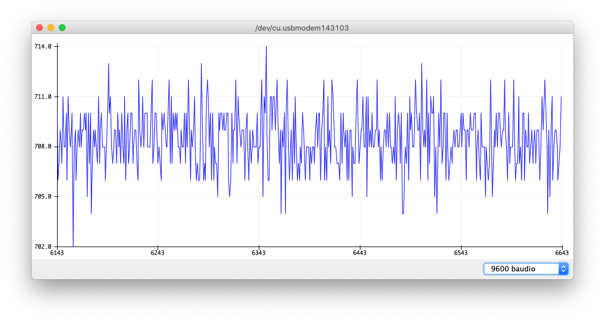

# ADCs

</br>

[ADC or _Analog-to-Digital Converter_](https://en.wikipedia.org/wiki/Analog-to-digital_converter) is a fundamental peripheral in [AMS (_Analog Mixed Signal_)](https://en.wikipedia.org/wiki/Mixed-signal_integrated_circuit) circuits or mixed-signal circuits. With the **ADC**, we will be able to **convert a continuous voltage signal into a digital signal** by performing a **discretization** and **quantification** of the **continuous signal**.

<p align="center">
<a href="../assets/imgs/grafico-conversion.png">

</a>
</p>

> In the image: discretization and quantification of an analog voltage signal. Characteristics of the analog signal: amplitude 3.3 V<sub>p-p</sub>, frequency of 1 Hz, and offset of 1.65 V. Characteristics of the conversion: 3-bit resolution, 3.3 V reference voltage, and sampling rate of 25 Sps.

Let’s quickly review ADCs, remembering what reference voltage, [resolution bits](https://en.wikipedia.org/wiki/Analog-to-digital_converter#Resolution), and [_sampling rate_](<https://en.wikipedia.org/wiki/Sampling_(signal_processing)#Sampling_rate>) are:

- **Resolution bits:** this is the number of bits the ADC has to generate a digital value from an analog signal value. For example, if an ADC has 10 bits, the ADC can generate up to 2<sup>10</sup> values (from 0 to 1023 in decimal). Another example, as shown in the image, if an ADC has 3 bits, it can generate up to 2<sup>3</sup> values (from 0 to 7 in decimal). Along with the reference voltage, the number of bits of an ADC sets the resolution of the ADC.
- **Reference voltage:** a fixed reference voltage value (V<sub>ref</sub>) used to compare it with the input analog signal (V<sub>signal</sub>) being quantified. For example, assuming a 10-bit ADC, if the input signal is equal to the reference voltage, the ADC will output 1023, the highest value. If the input signal is one-third of the reference voltage, the ADC will output 341 (one-third of 1023). The conversion formula would be:

```math
\textup{ADC}_{\textup{value}}=\frac{\textup{V}_{\textup{signal}}}{\textup{V}_{\textup{ref}}}(2^{\textup{bits}}-1)
```

- **_Sampling rate_:** the number of samples per second we take from the analog signal. It can be given in hertz or Sps (_Samples per second_). Here, we need to remember to apply the [Nyquist criterion](https://en.wikipedia.org/wiki/Nyquist_rate).

There you go. Summarized ADCs in four and a half paragraphs 🤣 Now, seriously, ADCs are a whole world on their own, and here we will only see how to operate them with the microcontroller. With the basic information we've covered, that will be enough.

Before getting into the subject, we’ll see that **Arduino’s offering for working with ADCs is very basic**. More advanced things could be done and Arduino could be twisted a bit, but the complexity level to do that would make direct register-level work more efficient. Therefore, **in this practice, we will incorporate this teamwork for the first time** in the course. As a challenge, we will make a common program/project between you and your partner. _Let's go!_

## Objectives

- Introduction to ADCs in Arduino.
- Combination of _timers_ and ADC in Arduino for fixed _sampling rates_.
- Introduction to Git-based _workflows_ for team collaboration.

## Procedure

### Conversion with a voltage divider

We will see how to read an analog signal from a voltage divider implemented with a joystick. The first thing we will do is learn how to connect this joystick.

#### Joystick connection

Do you like your computer? Would you like it to last many years? Well, **make sure to follow these steps carefully** since we will be connecting the joystick to the EVB, which in turn is connected to your computer's USB port. If you cause a short circuit... 🔥 I'll leave it at that.

> Actually, **the EVB has a safety system** that protects the USB port from potential short circuits. But the ideal and recommended approach is **not to tempt fate**.

In the next image, we have the symbol of the potentiometer circuit and its _pinout_.

<p align="center">
<a href="../assets/imgs/potenciometro-simbolo.png">

</a>
</p>

With the EVB disconnected from the USB port, i.e., without power, we will connect the `GND` terminal to, oh, surprise, `GND` and the **`+5V` terminal to `3V3`** (careful, do not connect the `+5V` terminal to the `5V`...). The **_labels_ of the [_silkscreen_](https://en.wikipedia.org/wiki/Printed_circuit_board#Silkscreen_printing)** on the PCB show where you can find these nodes. With this, we will be creating a **voltage divider that we will control with the position of the joystick**. The **variable terminal** (which in this case would be either `VRx` or `VRy`, depending on which joystick axis we want to read), the output of the divider, we **connect to `A0`**.

Now, connect the EVB to the USB port and we can go to the Arduino IDE to program.

#### Reading an analog signal

To **read an analog signal in Arduino**, simply use the **`analogRead`** function, specifying the pin where the signal to be read is connected. That's it. Nothing else. No need to configure the pin or anything. We can just collect and head home.

No, no, no! Just kidding. Let's play around a bit since working with ADCs in Arduino is so easy.

We will create a _sketch_ called `masb-p04` in the `arduino` folder of our local repository.

> [!NOTE]
> You will notice that the screenshots are from an older version of the Arduino IDE. Do not worry. The procedure is the same.

In the program, **we will create a numeric variable of type `int`** called adcVal to store the value resulting from the ADC conversion. The program will look like this:

```c
int adcVal = 0; // variable to store the conversion

void setup() {
  // put your setup code here, to run once:

}

void loop() {
  // put your main code here, to run repeatedly:

  adcVal = analogRead(A0); // read the conversion value
}
```

We compile and upload the program. Does it work? No idea 🤣 **We have no way to see if the conversion is taking place or not**, and **we don't have debugging tools like _breakpoints_, which we do have in STM32CubeIDE**. Therefore, we will take the step to introduce serial communication. But just a little bit 🦶🏻

#### Serial communication

**We will cover it in detail in later sessions**, but basically what we will do is **establish serial communication between our computer and the microcontroller** and make the microcontroller send the ADC conversion values so we can see that everything is working.

Until we get to that point in later sessions, simply follow these steps.

1. We initialize the serial communication in the `setup` function with the instruction `Serial.begin(9600)`, where 9600, as we will see in another session, is the **_baudrate_**.
2. We use the `Serial.println` function to **send a text/number** followed by **a carriage return** so that the numbers we send appear on separate lines in the computer.

The code will look like this:

```c
int adcVal = 0; // variable to store the conversion

void setup() {
  // put your setup code here, to run once:
  Serial.begin(9600); // configure serial communication
}

void loop() {
  // put your main code here, to run repeatedly:

  adcVal = analogRead(A0); // read the conversion value
  Serial.println(adcVal); // send the conversion value to the PC
}
```

We compile, upload, and... Still see nothing 🤨

We need to **open the serial terminal** to see the data the microcontroller is sending us. To do this, first, **configure the COM port** where the microcontroller is sending information. Go to `Tools > Port` and select `COM<X>`, where `<X>` will be a number. If more than one `COM` port appears, you will need to try until you find the one corresponding to our board. (You can check which is our `COM` port from the `Device Manager` in Windows). Then, go to `Tools > Serial Monitor`, and a terminal will open where the values generated by the ADC and sent by the microcontroller to the computer will appear.

> For users of Cupertino products, instead of `COM<X>`, the ports will appear in the style of `/dev/cu.usbmodem143103`. It may vary slightly, like the numbering, for example.

<p align="center">
<a href="../assets/imgs/monitor-serie.png">

</a>
</p>

If we move the joystick, we will see that the values in the terminal vary between 0 and 1023.

The terminal is extremely useful, but to see a value that updates continuously... it can be impractical. Arduino IDE gives us a second tool. **Close the serial terminal**, and with the **COM port configured**, go to `Tools > Serial Plotter`. A graph will open, and its data will be updated with the values sent by the microcontroller.

<p align="center">
<a href="../assets/imgs/serial-plotter.png">

</a>
</p>

As we can see, **the Y-axis auto-scales** to the values shown in the graph. This means that if we don't move the joystick, the axis will auto-scale with a very small range. To **force the graph to have a minimum and maximum** on the Y-axis, we will **send three values per series**: the **minimum** (0), the **ADC value**, and the **maximum** (1023). The numbers, so that the _Serial Plotter_ can interpret them correctly, must be separated by a comma. We would do it as follows:

```c++
int adcVal = 0; // variable to store the conversion

void setup() {
  // put your setup code here, to run once:
  Serial.begin(9600); // configure serial communication
}

void loop() {
  // put your main code here, to run repeatedly:

  adcVal = analogRead(A0); // read the conversion value

  Serial.print(0); // send the minimum
  Serial.print(","); // comma to separate the numbers
  Serial.print(adcVal); // send the conversion value to the PC
  Serial.print(","); // comma to separate the numbers
  Serial.println(1023); // send the maximum with a newline
}
```

**Be careful**, as now we **have used a different function to send the ADC value**. We did not use `println` (with a carriage return), but rather `print`. `println` is used to send the last value sent: the maximum.

We close the _Serial Plotter_, compile, upload, and then reopen the _Serial Plotter_. Now, three values/signals are being sent to us: two constant signals to set the scale of the Y-axis and one signal that is the ADC value.

<p align="center">
<a href="../assets/imgs/serial-plotter-wo-autoscale.png">

</a>
</p>

As you can see, it was quick. Now let's look at the challenge.

> ![NOTE]
> Arduino IDE does not allow you to configure how many points are displayed on the graph. Since we're grabbing ADC values as fast as possible, it's hard to see how the voltage is rising and falling on a single graph. Here we have two options: (the recommended one) use a program that allows graph configuration, such as [Serial Studio](https://serial-studio.github.io), or put a `delay` of, I don’t know, maybe 200 ms?, in the `loop` function so that fewer points are sent. Choose whichever option annoys you less.

## Challenge: Control of the _sampling rate_

In applications where an analog signal is captured/converted, **it is very important to establish a known and stable _sampling rate_**. Just like we did in the previous program, this doesn’t happen. If for some reason we added more code to the `loop` function (which would be the most normal), the conversion would happen when it hits the `analogRead` instruction, but all the code before or after in the `loop` function would have been executed first. This means we can't get a _sampling rate_ that we want, as we cannot determine how long it will take for the microprocessor to execute the rest of the instructions.

> For example, in the previous case, we can't say that we want a _sampling rate_ of 1 Sps.

We also can't guarantee that the _sampling rate_ will be constant since, if there is a conditional statement (`if-else`) or a loop with variable iterations, the execution time of the `loop` function code will differ each time. We need to ensure that the `analogRead` instruction is executed with a constant periodicity of our choice. Can you think of something? Yes. _Timers_.

Now, let's look at an example of a **project** with an **ADC conversion** at a **_constant sampling rate_ of 10 Sps**. Additionally, **we will enable and disable the conversion at will with the button**.

#### Basic _Workflow_ for teamwork

We will do this challenge in pairs. For the first time, we will work on an **Arduino project using more than one file**. **Each member will work on different files**. Below, you'll find the file structure that the project folder will have.

```
arduino
└── masb-p04
    ├── adc.ino
    ├── gpio.ino
    ├── masb-p04.ino
    └── timer.ino
```

**Arduino IDE takes the `.ino` file with the same name as the folder as the main file** (it's like the `main.c` in STM32CubeIDE). Therefore, the `masb-p04.ino` file will be the main file. The rest of the files are, for practical purposes, extensions of this main file. Instead of having everything in a single file, **we can separate it into multiple files**, improving **code readability** and **teamwork**.

The **tasks are divided** between team member `A` and team member `B`.

> Now is when you run to the phone to ask your teammate if they want to be/do `A` or `B` 📱🏃🏻‍♀️

Team member `A` will take care of the following files:

- `masb-p04.ino`
- `adc.ino`

Team member `B` will take care of the following files:

- `gpio.ino`
- `timer.ino`

Now, we will separate the workflow of both members into two distinct sections. Make sure to **complete your tasks**, but **it’s recommended that you also read your teammate’s section** to know what they’ve done.

#### Workflow of member "A"

##### Development Branch

The first thing we’ll do is **go to the `main` branch** and **import** all the possible **changes**/updates that might have occurred in the **remote repository**.

```bash
git switch main
git pull
```

Next, we will **create our development branch**. We will name it slightly differently than usual.

```bash
git switch -c develop/A-<full-name-without-spaces-nither-strange-characters>
```

##### Development of masb-p04.ino

Go to Arduino IDE and save a **_sketch_ as `masb-p04`** in the **`arduino` folder** of our local repository. In this _sketch_, apart from initializing serial communication, we will call two functions that **initialize the GPIO and the _timer_**. "But the `B` member does that!" He will implement it, we will just call the functions he/she has to make. These functions to initialize the GPIO and the _timer_ will be called `GPIO_Init` and `TIMER_Init`, respectively.

> In a professional environment, the functions would be named this way because you and your colleague agreed on it, or because your supervisor or software architect told you so. The point is that both members have to use the same naming convention.

The code would look like this:

```c++
void setup() {
  // put your setup code here, to run once:
  Serial.begin(9600); // configure serial communication

  TIMER_Init(); // initialize the timer
  GPIO_Init(); // initialize the GPIO
}

void loop() {
  // put your main code here, to run repeatedly:

}
```

We have completed the planned development for the `masb-p04.ino` file. We will only initialize the indicated peripherals and won't do anything in the `loop` function, as we will handle everything with interrupts.

This would be a good time to **make a _commit_** and **_push_**.

##### Development of adc.ino

With the `masb-p04.ino` file open, to create this file, click on the **right arrow** all the way to the right, which is **aligned with the file name**, and select `New Tab`.

<p align="center">
<a href="../assets/imgs/crear-nuevo-archivo-proyecto.png">

</a>
</p>

It will ask for a name. Enter `adc`. This will create an `adc.ino` file in the `masb-p04` folder. In this file, **we will create a function called `conversionADC`** that will be called by our partner from the _timer_.

> Our partner will know the function is called `conversionADC` because that’s what we agreed on, or our superior or the software architect told us to.

In the file, we will start by creating a **macro** to refer to the pin we will use for the ADC. Then, we will **create two variables**: `valADC` and `onADC`. The first will store the **resulting value from the ADC conversion**, and the second will be used to configure the ADC as **off or on**. The code will look like this:

```c++
#define ANALOG_PIN    A0

int valADC = 0; // variable to store the conversion value
bool onADC = false; // variable that tells us if the ADC is off or on

// perform a conversion if the ADC is on and send it via serial port
void conversionADC(void) {

}
```

We still need to implement the `conversionADC` function. In this function, we will check if the ADC is on or off, and if it is on, we will perform an ADC conversion and display it through the _Serial Plotter_. Our partner will control the value of `onADC` from the button's ISR. The final code will look like this:

```c++
#define ANALOG_PIN    A0

int valADC = 0; // variable to store the conversion value
bool onADC = false; // variable that tells us if the ADC is off or on

// perform a conversion if the ADC is on and send it via serial port
void conversionADC(void) {

  if (onADC) { // if it is on

    valADC = analogRead(ANALOG_PIN); // perform a conversion

    Serial.print(0); // send the minimum value
    Serial.print(","); // space to separate the numbers
    Serial.print(valADC); // send one element from the ADC buffer
    Serial.print(","); // space to separate the numbers
    Serial.println(1023); // send the maximum value with carriage return
  }
}
```

We save and make a **_commit_**. Also, make a **_push_** to upload the changes to the server.

##### _Pull Request_ and _Review_

Our work would have finished. Or almost. **There are two things missing**. First of all, **make a _Pull Request_ from this branch to _main_ and <u>importantly, set our partner `B` as the _reviewer_</u>**. He will review our code and, if it looks `OK`, either you or he can perform the `merge` to the master branch. If it doesn't get the `OK`, you will need to address any requested changes, make the necessary modifications, upload the changes, and request a second review or _re-request_.

Your work doesn't end here, because now **you need to go to your partner's _Pull Request_**, **check that everything is `OK`**, and if so, approve the _Pull Request_. If you are not satisfied with his development, let him know and suggest changes. Once he applies them, approve the _Pull Request_ and either you or he should perform the `merge` to the `main` branch.

I leave you a [link](https://help.github.com/en/github/collaborating-with-issues-and-pull-requests/reviewing-changes-in-pull-requests) to GitHub's help documentation where you can see in detail everything you can do during the _Pull Request_ review.

> In this project, it doesn't matter who does the first _merge_ to the `main` branch.

#### Workflow of member "B"

##### Development Branch

The first thing we will do is **go to the `main` branch** and **import** all possible **changes**/updates that may have occurred in the **remote repository**.

```bash
git switch main
git pull
```

Next, we **create our development branch**. We will name it slightly differently than usual.

```bash
git switch -c develop/A-<full-name-without-spaces-nither-strange-characters>
```

##### Development of gpio.ino

The first thing we will do is create a **_new sketch_** in Arduino IDE and **save it as `gpio` in the `arduino` folder** of our local repository. In this file, we will **create two functions**: `GPIO_Init` and `toogleStateADC`. In the first function, we will **initialize the GPIO** (set mode to `INPUT` and configure an ISR), and the second function will be the **ISR that runs when the button is pressed**. Your teammate will call the first function, `GPIO_Init`, from the `setup` function in the `masb-p04.ino` file.

> Your teammate would know the names of your functions to call them because, in a professional environment, you both agreed on them or your supervisor or the software architect told you what to use. The point is, both team members need to use the same naming conventions.

> ![IMPORTANT]
> When creating the `gpio.ino` file, it will be created inside a `gpio` folder. Remember that there should be no folder inside `arduino` beyond `masb-p04`. Therefore, before making a `commit` and `push`, move the files you create in this development to the `arduino/masb-p04` folder.

We would also create a **macro** to make the code easier to read. The code would look like this:

```c++
#define PUSH  23

// GPIO configuration
void GPIO_Init(void) {

}

void toogleStateADC(void) {
  // ISR for the BUTTON

}
```

In `GPIO_Init`, we configure the GPIO and its ISR.

```c++
#define PUSH  23

// GPIO configuration
void GPIO_Init(void) {

  pinMode(PUSH, INPUT); // configure PUSH as an input GPIO
  // add an interrupt to the PUSH pin for a transition from HIGH to LOW (falling)
  attachInterrupt(digitalPinToInterrupt(PUSH), toogleStateADC, FALLING);

}

void toogleStateADC(void) {
  // ISR for the BUTTON

}
```

**In the ISR, we toggle the value of the `onADC` variable**. `onADC` is a variable declared by our teammate in the `adc.ino` file to configure whether the ADC is turned off or on. You know the name of this variable because that's what you agreed on with them, or because your superior instructed you to name it that way. The code would look as follows:

```c++
#define PUSH  23

// GPIO configuration
void GPIO_Init(void) {

  pinMode(PUSH, INPUT); // configure PUSH as an input GPIO
  // add an interrupt to the PUSH pin for a transition from HIGH to LOW (falling)
  attachInterrupt(digitalPinToInterrupt(PUSH), toogleStateADC, FALLING);

}

void toogleStateADC(void) {
  // ISR for the BUTTON

  onADC = !onADC; // toggle the state of the ADC

}
```

We have finished the `gpio.ino` file. It would be a good time for a **_commit_** and **_push_**.

##### Development of timer.ino

With the `gpio.ino` file open, to create this file, click on the **arrow on the far right** aligned with the file name and select `New Tab`.

<p align="center">
<a href="../assets/imgs/crear-nuevo-archivo-proyecto.png">

</a>
</p>

> In the image, it shows that we are in the `masb-p04` file. That doesn't matter. It's just to illustrate where we need to click 😒

It will ask for a name. We put `timer`. This will create a `timer.ino` file in the `gpio` folder. In this file, **we will create two functions**: `TIMER_Init` and `startAdcConversion`. The first one will be used to **configure the _timer_**, and our teammate will call it from the `setup` function. The second function will be the **ISR that we execute every 100 ms**. We create both functions and configure _timer_ 3 to execute the `startAdcConversion` ISR every 100 ms. The code would look like this:

```c++
void TIMER_Init(void) {

  // Timer 3 configuration
  HardwareTimer *MyTim = new HardwareTimer(TIM3);

  MyTim->setMode(2, TIMER_OUTPUT_COMPARE); // configure the timer mode with no output on any pin
  MyTim->setOverflow(100000, MICROSEC_FORMAT); // set the timer period to 100 ms
  MyTim->attachInterrupt(startAdcConversion); // specify the ISR to be executed
  MyTim->resume(); // start the timer
}

// Timer ISR
void startAdcConversion(void) {

}
```

Finally, **in the ISR, we call the `conversionADC` function** that our teammate has implemented to perform an ADC conversion if it is enabled.

```c++
void TIMER_Init(void) {

  // Timer 3 configuration
  HardwareTimer *MyTim = new HardwareTimer(TIM3);

  MyTim->setMode(2, TIMER_OUTPUT_COMPARE); // configure the timer mode with no output on any pin
  MyTim->setOverflow(10000, MICROSEC_FORMAT); // set the timer period to 100 ms
  MyTim->attachInterrupt(startAdcConversion); // specify the ISR to be executed
  MyTim->resume(); // start the timer
}

// Timer ISR
void startAdcConversion(void) {

  // try to start ADC conversion
  conversionADC();

}
```

With this, we would have the file finished. It’s the ideal moment for a **_commit_** and **_push_** of our changes.

##### Renaming the Folder

**By default, Arduino IDE creates a folder with the same name as the _sketch_ we’ve created** and stores the `.ino` file inside it. This is because, as we mentioned earlier, for Arduino IDE the main file is the one with the same name as the folder that contains it. However, this is not the case for us. **Our main file is named `masb-p04.ino` and it’s being developed by our teammate**. Therefore, **we will go to the `arduino` folder** in our local repository **and rename the `gpio` folder to `masb-p04`**.

Once the change is done, do a **_commit_** and **_push_**.

##### _Pull Request_ and _Review_

Our work is almost finished. **Two things are still pending**. First, **create a _Pull Request_ from this branch to the _main_ and, importantly, put our teammate `A` as the _reviewer_**. They will review our code, and if they approve it, either of you can perform the `merge` to the master branch. If they do not approve it, you’ll need to address the requested changes, make the necessary modifications, push the changes, and create a second review request.

Your work doesn’t end here because now **you will need to go to your teammate’s _Pull Request_, review that everything is `OK`**, and if so, approve their _Pull Request_. If you are not satisfied with their development, let them know and suggest changes. Once they apply the changes, approve their _Pull Request_ and either you or they will perform the `merge` to the `main` branch.

Here is a [link](https://help.github.com/en/github/collaborating-with-issues-and-pull-requests/reviewing-changes-in-pull-requests) to GitHub’s help documentation where you can see in detail everything you can do during the _Pull Request_ review process.

> In this project, it doesn’t matter who does the _merge_ to the `main` branch first.

#### Summary

And with this, you’ve done your **first project together**! Now I’ll go to the `main` branch and check out your project 😊

As you’ve seen, sometimes we call functions that are not ours, and whose names we shouldn’t initially know. **Git-based workflows**, or other tools, enable parallel development and collaboration on the same project. But **they don’t replace the essential team meetings** where **decisions are made** regarding the software architecture of a project, its directory structure, **how we’ll name the functions we implement**, etc. And typically, **all of this is documented** so it’s available to all team members.

## Evaluation

### Deliverables

These are the elements that should be available for evaluation.

- [ ] **Commits**

It is up to you when to make the _commits_. There is no minimum/maximum number, and the proper use of version control will be assessed (branch creation, _commits_ at the right times, descriptive change messages, etc.).

- [ ] **Challenge**

### Pull Request

Once all deliverables are completed, remember to do the appropriate _push_ and create a _Pull Request_ (PR) from your branch to the main. Remember to add me as a _Reviewer_ (except for the challenge one 😉).

### Rubric

You can find the rubric for evaluation on the CampusVirtual. We recommend taking a look so you know exactly what will be evaluated and what is expected from you.

**The evaluation will start with the cleanliness and readability of the code** (properly aligned statements, nested statements indented, aligned braces, comments, etc.).

## Conclusions

In this practice, we’ve taken advantage of how **easy the ADC in Arduino is** (just use the `analogRead` function) to begin seeing how we can work on a **joint project** with our teammate. We’ve learned **how to develop in parallel** and how to **merge everything into one branch**. We’ve also seen how **git doesn’t replace the need for team meetings to agree on technical aspects of the project** that all development team members must follow. Finally, in this project, we saw how to **set a constant _sampling rate_**. This is crucial in ADC-based applications.
