# ADCs

</br>

In the first part of this practice, we _played_ with the ADC in Arduino. In this second part, we are going to **operate the ADC using HAL** in STM32CubeIDE. Once again, more ~~difficulty~~ complexity brings **greater flexibility**.

We will see how to operate the **ADC with blocking functions** (functions based on the _polling_ technique), how to perform a **scan on more than one input channel** of the ADC, and how to combine the ADC with a new peripheral: the [**DMA (_Direct Memory Access_)**](https://en.wikipedia.org/wiki/Direct_memory_access).

## Objectives

- Introduction to ADCs in STM32CubeIDE.
- Operating the ADC with blocking functions.
- Channel conversion scanning of the ADC.
- Combining DMA with the ADC.
- Periodic conversions using a _timer_.
- Temperature measurement with the ADC's internal channel.
- First look at serial communication.

## Procedure

### Reading the output of a joystick

In this first project, we will **read the signal generated by the voltage divider** implemented with the joystick. Once the signal is read, **we will send it to the computer** using serial communication via [UART (_Universal Asynchronous Receiver-Transmitter_)](https://en.wikipedia.org/wiki/Universal_asynchronous_receiver-transmitter).

#### Project creation

We will create a new development branch from the `main` branch. In the `stm32cube` folder, we create a project named `masb-p04`.

#### ADC configuration

We start by configuring the pin where the joystick's variable terminal is connected.

> The joystick connection is made as in the first part of the practice.

The **pin** to which it is connected is `PA0`. We locate this pin in the `Pinout view` and **configure it as `ADC1_IN0` with the _label_ `RDIV`**. The `ADC1_IN0` nomenclature indicates that it is **channel 0 of ADC 1.** Next, we go to the side menu and, within the `Analog` dropdown, click on `ADC1`. This will take us to the **configuration form of the only ADC** available on this microcontroller.

<p align="center">
<a href="../assets/imgs/adc-configuration.png">
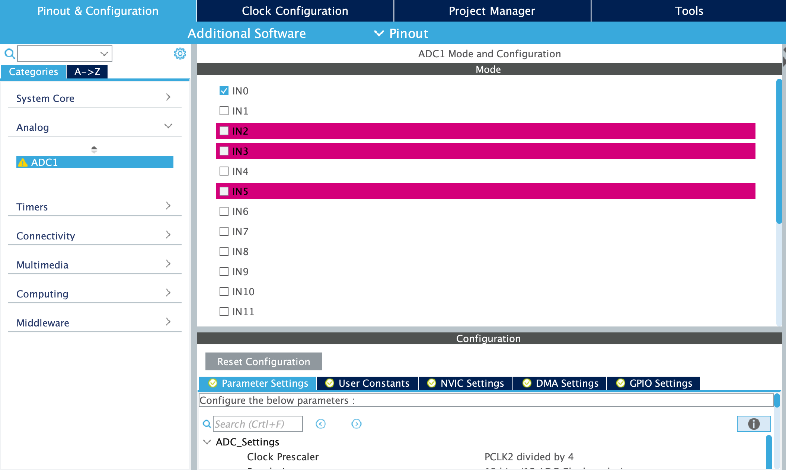
</a>
</p>

At the top, called `Mode`, the ADC channels are displayed. **An ADC channel is an input to it**. The ADC has 16 channels plus a couple of internal ones. One of these internal channels is connected to an internal temperature sensor of the microcontroller.

> **There is only one ADC**. But that single ADC can convert the signal from each of its channels **by alternating** between them. **It cannot read all channels simultaneously**.

Currently, channel `IN0` is enabled because we previously configured the pin for that channel.

At the bottom of the ADC configuration form, under `Configuration`, we set the **ADC parameters** themselves: operating frequency, resolution, data alignment, enabling/disabling different conversion modes, etc. I leave you with the arduous task of reading the [microcontroller documentation](https://www.st.com/content/ccc/resource/technical/document/reference_manual/5d/b1/ef/b2/a1/66/40/80/DM00096844.pdf/files/DM00096844.pdf/jcr:content/translations/en.DM00096844.pdf) on ADC operation to understand what each setting does (page 213). For now, **we will leave everything as default**.

> There is a super useful button called `Reset Configuration` that resets the ADC configuration to its default state if you change anything.

<p align="center">
<a href="../assets/imgs/adc-configuration-2.png">
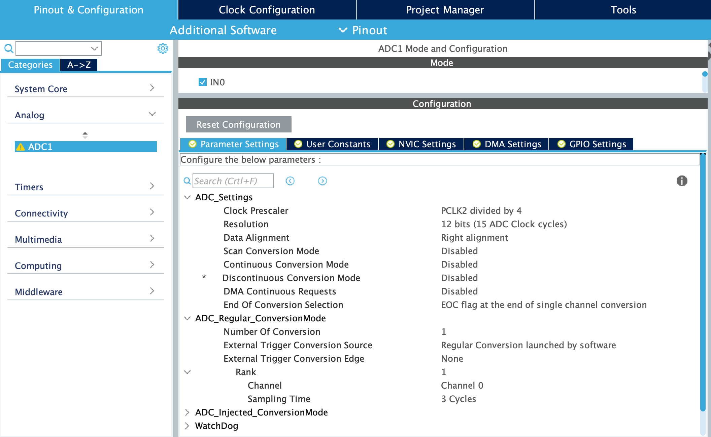
</a>
</p>

We save the configuration file and generate the code. Let's go to `main.c`.

#### Blocking operation of the ADC

Now we will see how to read an analog signal with the ADC using blocking functions. It is called **blocking** because we will first start the conversion and then use **_polling_** to continuously check the conversion status and wait for it to finish before reading the obtained result.

The functions we will use are: `HAL_ADC_Start`, `HAL_ADC_PollForConversion`, and `HAL_ADC_GetValue`. The first function is responsible for **starting an ADC conversion**. The second function makes the **code stop execution until the initiated conversion is complete**. The last function is used to **obtain the resulting value** of the conversion. What we will do is start the conversion, wait for it to finish, and store the result in a `uint32_t` variable called `potADC`. The `main` function would look like this:

```c
...
  /* USER CODE BEGIN 2 */

  uint32_t potADC = 0; // no need to be global, it's local

	/* USER CODE END 2 */

  /* Infinite loop */
  /* USER CODE BEGIN WHILE */
  while (1)
  {
    HAL_ADC_Start(&hadc1); // start the conversion
    HAL_ADC_PollForConversion(&hadc1, 200); // wait for the conversion to finish
    																				// if it doesn't finish in 200 ms, exit
	  potADC = HAL_ADC_GetValue(&hadc1);  // read the conversion result and
                                        // store it in potADC
    /* USER CODE END WHILE */

    /* USER CODE BEGIN 3 */
  }
  /* USER CODE END 3 */
...
```

If we compile the project, **the following _warning_ will appear**:

```bash
variable 'potADC' set but not used [-Wunused-but-set-variable]
```

The compiler is telling us that **we have created a variable that we do not use later**. That is, we store a value in it, but then we do nothing with this value. This is a _warning_ that, as the compiler is configured by default, does not cause any issues; however, it is an important _warning_ because **the compiler would assume that we do not use it, that we do not need it, and therefore it would not create the variable and would remove it**.

How can we avoid this _warning_? There are two ways. The first is to add `volatile` to the variable declaration. The compiler does not optimize this variable and therefore does not eliminate it if it is unused. However, we know that using the `volatile` _keyword_ affects how the variable is read/written in memory.

The second way is to **reference the variable without doing anything with it**. We do this with `(void)potADC;`. We reference the variable, but do nothing with it. To keep this new instruction from getting in the way, we can **add it right after the _while loop_** since **the program execution will never go beyond that loop**. The `main` function would look like this:

```c
...
  /* USER CODE BEGIN 2 */

  uint32_t potADC = 0; // no need to be global, it's local

	/* USER CODE END 2 */

  /* Infinite loop */
  /* USER CODE BEGIN WHILE */
  while (1)
  {
    HAL_ADC_Start(&hadc1); // start the conversion
    HAL_ADC_PollForConversion(&hadc1, 200); // wait for the conversion to finish
    																				// if it doesn't finish in 200 ms, exit
		potADC = HAL_ADC_GetValue(&hadc1);  // read the conversion result and
                                        // store it in potADC
    /* USER CODE END WHILE */

    /* USER CODE BEGIN 3 */
  }
	(void)potADC; // avoid warning
  /* USER CODE END 3 */
...
```

With no errors or _warnings_ during compilation, we start debugging the program.

Once the program is running, **we add a _breakpoint_ at the `HAL_ADC_Start(&hadc1)` instruction**. On the right, we have the `Variables` window where the variable `potADC` and its value appear. **Each time we resume the program execution and it stops at the _breakpoint_, the value of the variable in the `Variables` window updates.** Verify that by changing the joystick position, the variable's value changes accordingly.

<p align="center">
<a href="../assets/imgs/variable-window.png">
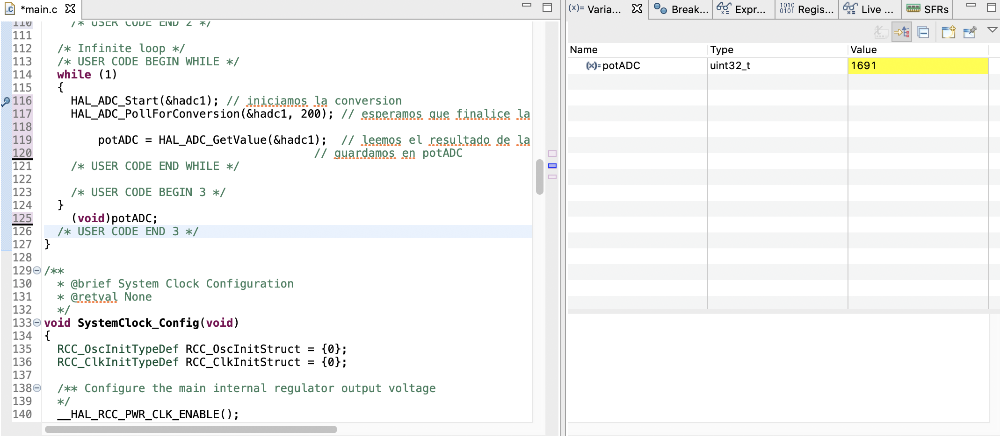
</a>
</p>

### Serial Communication

There are advanced debugging tools that allow real-time visualization of the microcontroller's memory. This would enable us to check the ADC's operation. However, for now, those tools are a bit too advanced for us. Instead, we will use serial communication to **send the ADC result to the computer** and **visualize the data using the `Serial Monitor` and `Serial Plotter` in <u>Arduino IDE</u>**.

> If we already have a serial terminal application in Arduino IDE, why install another one? Let's use what we already have.

**Serial communication is not the focus of this practice.** We also don't need to configure anything since, when creating the project, we initialized the microcontroller peripherals to their default state, leaving the UART peripheral configured. Let's directly see how to send the value to the computer.

The function we will use is `HAL_UART_Transmit`. This function requires passing the appropriate configuration, a pointer to a _buffer_, the number of elements to be sent from that _buffer_, and the maximum execution time in milliseconds for this instruction. We will not cover the communication part in this practice. Simply add the necessary code so that the `main` function looks as follows:

```c
...
/* Private includes ----------------------------------------------------------*/
/* USER CODE BEGIN Includes */
#include <stdio.h>
/* USER CODE END Includes */

...

	/* USER CODE BEGIN 2 */

  uint32_t potADC = 0; // no need to be global, it's local
  char txBuffer[32] = { 0 }; // buffer for transmission
  uint8_t txBufferSize = 0; // size to send

  /* USER CODE END 2 */

  /* Infinite loop */
  /* USER CODE BEGIN WHILE */
  while (1)
  {
		HAL_ADC_Start(&hadc1); // start the conversion
		HAL_ADC_PollForConversion(&hadc1, 200); // wait for the conversion to finish
    																				// if it doesn't finish in 200 ms, exit
		potADC = HAL_ADC_GetValue(&hadc1);  // read the conversion result and
                                        // store it in potADC

		txBufferSize = sprintf(txBuffer, "%lu\n", potADC); // encode the number to text
		HAL_UART_Transmit(&huart2, &txBuffer, txBufferSize, 1000); // send the data

    /* USER CODE END WHILE */

    /* USER CODE BEGIN 3 */
  }
  /* USER CODE END 3 */
...
```

In addition to the code added to the `main` function, note that we have included a `#include` directive at the top of `main.c` (to make the `sprintf` function available) and removed `(void)potADC;` after the _while loop_ since we are now actually using the `potADC` variable, so the _warning_ will no longer appear.

We compile and debug. With the program running, **let’s open Arduino IDE**, **configure the serial port** as in the first part of the practice, and **open the `Serial Monitor`**. **Important: set the baud rate to 115200 in the bottom right corner of the monitor.**

The ADC results should now appear, sent by the microcontroller to the computer. If we move the joystick, we should see the values change.

<p align="center">
<a href="../assets/imgs/monitor-serie-2.png">
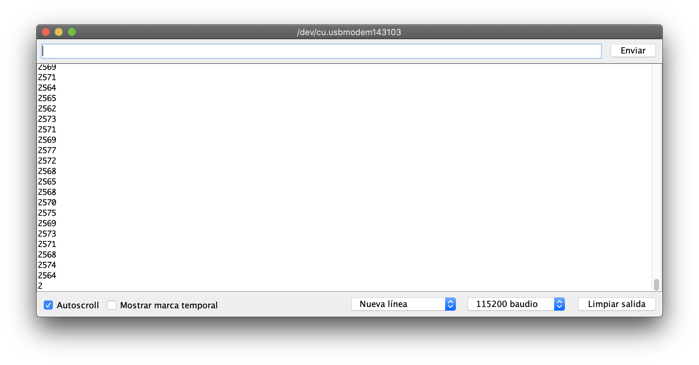
</a>
</p>

We know that Arduino IDE has the `Serial Plotter` to graph the results. We open it and... well... as expected, the y-axis auto-scales. To fix this, we will send the constants 0 and 4095 to the computer.

> This time, we send 4095 instead of 1023 because the ADC performs a 12-bit conversion. In Arduino, it is limited to 10 bits.

To achieve this, **we modify the instruction just before `HAL_UART_Transmit`**. The code should now look like this:

```c
...
	/* USER CODE BEGIN 2 */

  uint32_t potADC = 0; // no need to be global, it's local
  char txBuffer[32] = { 0 }; // buffer for transmission
  uint8_t txBufferSize = 0; // size to send

  /* USER CODE END 2 */

  /* Infinite loop */
  /* USER CODE BEGIN WHILE */
  while (1)
  {
		HAL_ADC_Start(&hadc1); // start the conversion
		HAL_ADC_PollForConversion(&hadc1, 200); // wait for the conversion to finish
    																				// if it doesn't finish in 200 ms, exit
		potADC = HAL_ADC_GetValue(&hadc1);  // read the conversion result and
                                        // store it in potADC

		txBufferSize = sprintf(txBuffer, "0,4095,%lu\n", potADC); // encode the number to text
		HAL_UART_Transmit(&huart2, &txBuffer, txBufferSize, 1000); // send the data

    /* USER CODE END WHILE */

    /* USER CODE BEGIN 3 */
  }
  /* USER CODE END 3 */
...
```

We compile, debug, start the program execution, and open the `Serial Plotter`. Now we have what we wanted. Move the joystick to check that everything is working correctly.

<p align="center">
<a href="../assets/imgs/serial-plotter-2.png">
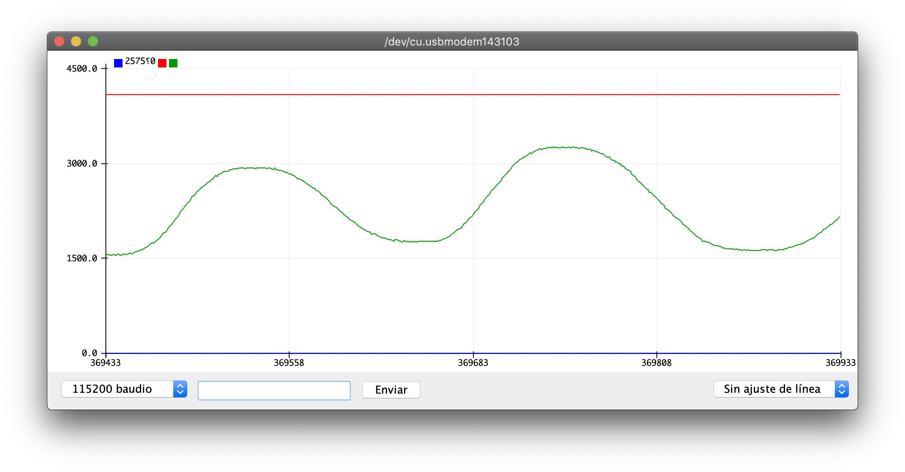
</a>
</p>

Now let's see how to read two ADC channels.

### Scan Mode

The name **"scan" comes from the fact that in this mode the ADC scans different channels** that we configure, so the ADC alternates between channels to perform a conversion on each one. In this part, we will read channel 0, which is connected to the joystick, and the internal channel connected to the temperature sensor.

#### Microcontroller Configuration

**Open the `.ioc` file** of our project and go to the ADC configuration form. In addition to the `IN0` channel that is already enabled, **enable the `Temperature Sensor Channel`**. In the lower `Configuration` subform, **enable `Scan Conversion Mode` and `Discontinuous Conversion Mode`**. In `ADC_Regular_ConversionMode`, set the `Number Of Conversion` to 2. Next, **in `Rank 2`, select `Channel Temperature Sensor` in the `Channel` field**. What we have done is enable the scan mode in discontinuous mode. What does this mean? It means that the conversions of both channels will not automatically happen consecutively; instead, **we will need to read the ADC to read the first channel and then read the ADC again to read the second**. There are other operating modes, but here we will use this one. The scan order of the channels is defined by the _ranks_. **It starts with ranks in ascending order**. We have configured rank 2 as the temperature sensor channel. Since we enabled two channels, it is implied that the `IN0` channel will be rank 1, so STM32CubeMX does not ask us to configure it explicitly. The ADC configuration form will look like this.

<p align="center">
<a href="../assets/imgs/adc-configuration-3.png">
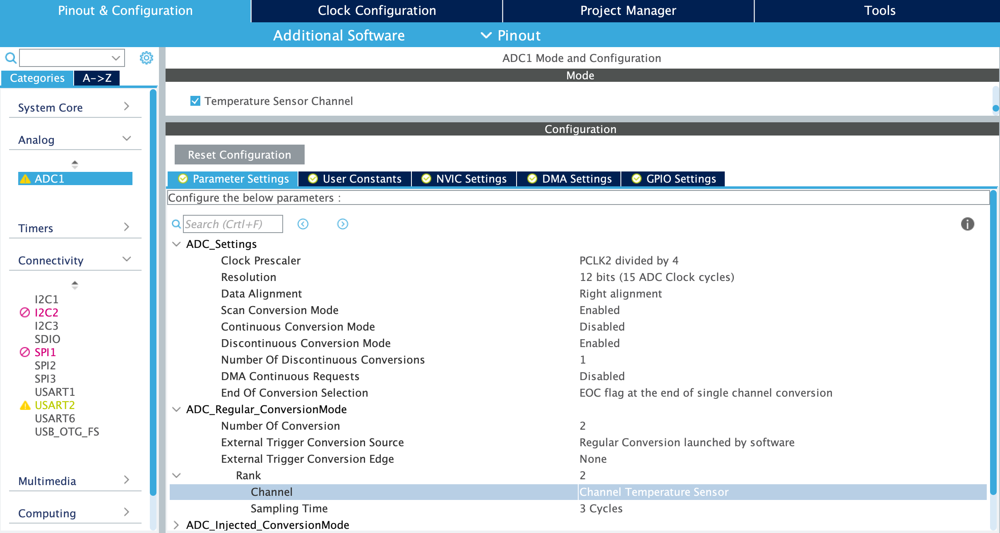
</a>
</p>

Save the configuration and generate the code.

#### Temperature Measurement

The process to convert the analog signal from two channels, as we have configured it, is not much different from the previous one. Simply, **we need to perform the previous process twice in a row**: once for the `IN0` channel and once for the temperature sensor channel. We create a **variable called `tempADC`** to store the result of the conversion from the temperature sensor channel. The `main` function would look like this:

```c
...
  /* USER CODE BEGIN 2 */

  uint32_t potADC = 0; // no need to be global, it's local
  uint32_t tempADC = 0; // no need to be global, it's local

  /* USER CODE END 2 */

  /* Infinite loop */
  /* USER CODE BEGIN WHILE */
  while (1)
  {
    HAL_ADC_Start(&hadc1); // start the conversion for the voltage divider
    HAL_ADC_PollForConversion(&hadc1, 200); // wait for the conversion to finish
    																				// if it doesn't finish in 200 ms, exit
    potADC = HAL_ADC_GetValue(&hadc1);

    HAL_ADC_Start(&hadc1); // start the conversion for the temperature sensor
    HAL_ADC_PollForConversion(&hadc1, 200); // wait for the conversion to finish
    																				// if it doesn't finish in 200 ms, exit
    tempADC = HAL_ADC_GetValue(&hadc1);  // read the conversion result and
                                         // store it in tempADC

    /* USER CODE END WHILE */

    /* USER CODE BEGIN 3 */
  }
  (void)potADC; // avoid warning
  (void)tempADC; // avoid warning
  /* USER CODE END 3 */
...
```

We compile, debug, and start the program. We add a **_breakpoint_ to the first `HAL_ADC_Start`** and in the `Variables` window, we check that the values of the `potADC` and `tempADC` variables are updated each time we resume/pause the execution of the code. With the `potADC` variable, it's easy: we move the joystick and see how it changes, but in the case of the temperature... **The value of the `tempADC` variable doesn't tell us much...** Let's calculate the real temperature based on the value of `tempADC`.

How to calculate the temperature from the value of `tempADC` is explained in the [microcontroller reference manual](https://www.st.com/content/ccc/resource/technical/document/reference_manual/5d/b1/ef/b2/a1/66/40/80/DM00096844.pdf/files/DM00096844.pdf/jcr:content/translations/en.DM00096844.pdf) on page 226. There, it tells us that the formula to use is:

```math
\textup{Temp(Celsius)}=\frac{\textup{V}_\textup{signal}-\textup{V}_\textup{25}}{\textup{Avg\_Slope}}+25
```

`V25` and `Avg_Slope` are two constants that can be found in the [_datasheet_ of the microcontroller](https://www.st.com/resource/en/datasheet/stm32f401re.pdf). `Vsignal` is the conversion of `tempADC` to voltage. We have the formula that relates the ADC digital value to the input signal voltage in the introduction of the first part of this practice. Do you dare to put together the expression we need to obtain the temperature from `tempADC`? It's a little tricky, and you should make an effort to deduce it, but let's move on 😒...

To calculate the temperature, we will first create a variable that can hold decimal values. This **variable will be of type `float` and we will call it `temp`**. To implement the constants of the formula that you have surely tried to deduce, we will use constants. The `main` function would look like this:

```c
...
  /* USER CODE BEGIN 2 */

  uint32_t potADC = 0; // no need to be global, it's local
  uint32_t tempADC = 0; // no need to be global, it's local

  float temp = 0; // variable for temperature
  const float sense = 3.3/4095, // ADC to voltage conversion factor
           v25 = 0.76, // reference voltage at 25 C
           avgSlope = 0.0025; // variation of sensor voltage with temperature

  /* USER CODE END 2 */

  /* Infinite loop */
  /* USER CODE BEGIN WHILE */
  while (1)
  {
    HAL_ADC_Start(&hadc1); // start the conversion for the voltage divider
    HAL_ADC_PollForConversion(&hadc1, 200); // wait for the conversion to finish
    																				// if it doesn't finish in 200 ms, exit
    potADC = HAL_ADC_GetValue(&hadc1);

    HAL_ADC_Start(&hadc1); // start the conversion for the temperature sensor
    HAL_ADC_PollForConversion(&hadc1, 200); // wait for the conversion to finish
    																				// if it doesn't finish in 200 ms, exit
    tempADC = HAL_ADC_GetValue(&hadc1);  // read the conversion result and
                                         // store it in tempADC

    temp = ((tempADC*sense-v25)/avgSlope)+25; // calculate the temperature

    /* USER CODE END WHILE */

    /* USER CODE BEGIN 3 */
  }
  (void)potADC; // avoid warning
  (void)temp; // avoid warning
  /* USER CODE END 3 */
...
```

Compile, debug, and start the program execution. With a **_breakpoint_ at the first `HAL_ADC_Start`**, check how now we have the `temp` variable giving us a temperature value. **You can blow on the microcontroller to raise and lower the temperature, respectively.**

It would be more impressive with the `Serial Plotter`... Alright. Add the following code to the `main` so you can see a temperature graph.

```c
...
  /* USER CODE BEGIN 2 */

  uint32_t potADC = 0; // no need to be global, it's local
  uint32_t tempADC = 0; // no need to be global, it's local

  float temp = 0; // variable for temperature
  const float sense = 3.3/4095, // ADC to voltage conversion factor
           v25 = 0.76, // reference voltage at 25 C
           avgSlope = 0.0025; // variation of sensor voltage with temperature

  char txBuffer[32] = { 0 }; // buffer for transmission
  uint8_t txBufferSize = 0; // size to send

  /* USER CODE END 2 */

  /* Infinite loop */
  /* USER CODE BEGIN WHILE */
  while (1)
  {
    HAL_ADC_Start(&hadc1); // start the conversion for the voltage divider
    HAL_ADC_PollForConversion(&hadc1, 200); // wait for the conversion to finish
    																				// if it doesn't finish in 200 ms, exit
    potADC = HAL_ADC_GetValue(&hadc1);

    HAL_ADC_Start(&hadc1); // start the conversion for the temperature sensor
    HAL_ADC_PollForConversion(&hadc1, 200); // wait for the conversion to finish
    																				// if it doesn't finish in 200 ms, exit
    tempADC = HAL_ADC_GetValue(&hadc1);  // read the conversion result and
                                         // store it in tempADC

    temp = ((tempADC*sense-v25)/avgSlope)+25; // calculate the temperature

    txBufferSize = sprintf(txBuffer, "10,30,%.3f\n", temp); // encode the number as text
    HAL_UART_Transmit(&huart2, &txBuffer, txBufferSize, 1000); // send the data

    HAL_Delay(20); // one average every 20 ms, otherwise the graph moves too fast
                   // but delays are bad, they shouldn't be used

    /* USER CODE END WHILE */

    /* USER CODE BEGIN 3 */
  }
  (void)potADC; // avoid warning
  /* USER CODE END 3 */
...
```

We will get an error like this:

```bash
The float formatting support is not enabled, check your MCU Settings from "Project Properties > C/C++ Build > Settings > Tool Settings", or add manually "-u _printf_float" in linker flags.
```

Simply, **we do what it asks us to do**. We go to the project properties from `Project > Properties` or right-click on the project file `masb-p04` in the `Project Explorer` on the right and go to `Properties`. In the pop-up window, we expand `C/C++ Build` in the sidebar menu and go to `Settings`. There, in the form on the right, we go to the `Tool Settings` tab and, with `MCU Settings` selected in the left submenu, we check the box `Use float with printf from newlib-nano (-u _printf_float)`. A picture is worth a thousand words. Here’s a screenshot of the project properties.

<p align="center">
<a href="../assets/imgs/properties-project.png">
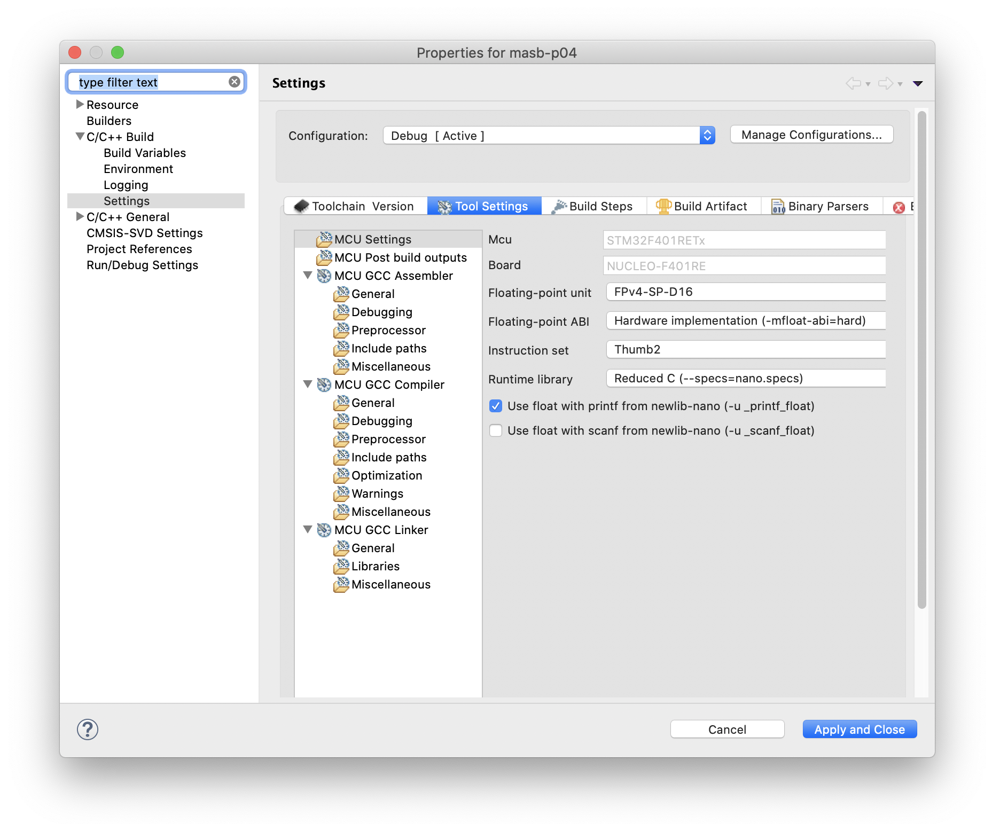
</a>
</p>

Now we **can go to the `Serial Plotter`** in Arduino IDE and see a temperature graph 😉

> Don’t expect miracles from the temperature sensor inside the microcontroller. It’s not very precise and has a lot of noise, but it’s not meant for fine temperature control.

<p align="center">
<a href="../assets/imgs/temperature-plot.png">
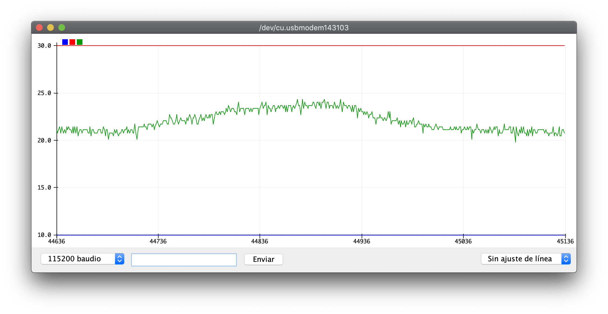
</a>
</p>

### _Direct Memory Access_

Oh my, the things you'll see today... 😅 But this will be quick. Let’s start with, what is **DMA**? It's just a **circuit that directly interacts between peripherals and the microcontroller’s memory to provide a direct communication channel**. Quick example: with DMA, we can make the ADC results go straight to memory without the CPU having to intervene.

> In practical terms, **the ADC results will be saved directly to a variable without us doing anything**. Useful, right?

Also, in this part, we will make _timer_ 2 trigger the ADC conversion periodically every 24 μs. Or in other words, 42 kSps.

#### Microcontroller Configuration

Let’s go to the ADC configuration form, and to start fresh for everyone, **we initialize the form by clicking the `Reset Configuration` button**. In the channel subform, we **make sure only the `IN0` channel is selected**.

In the `ADC_Regular_ConversionMode` section, we select `Timer 2 Trigger Out event` in the `External Trigger Conversion Source` field. Now, in the same subform, we go to the `DMA Settings` tab. There, we click the `Add` button. A new line will be created. In the first column, we select `ADC1` from the dropdown. Then, at the bottom, we set `Circular` in the `Mode` field and `Half Word` in the `Data Width` fields. We return to the `Parameters Settings` tab, and there we enable the `DMA Continuous Requests`.

The ADC and DMA configurations will look like this:

<p align="center">
<a href="../assets/imgs/adc-configuration-4.png">
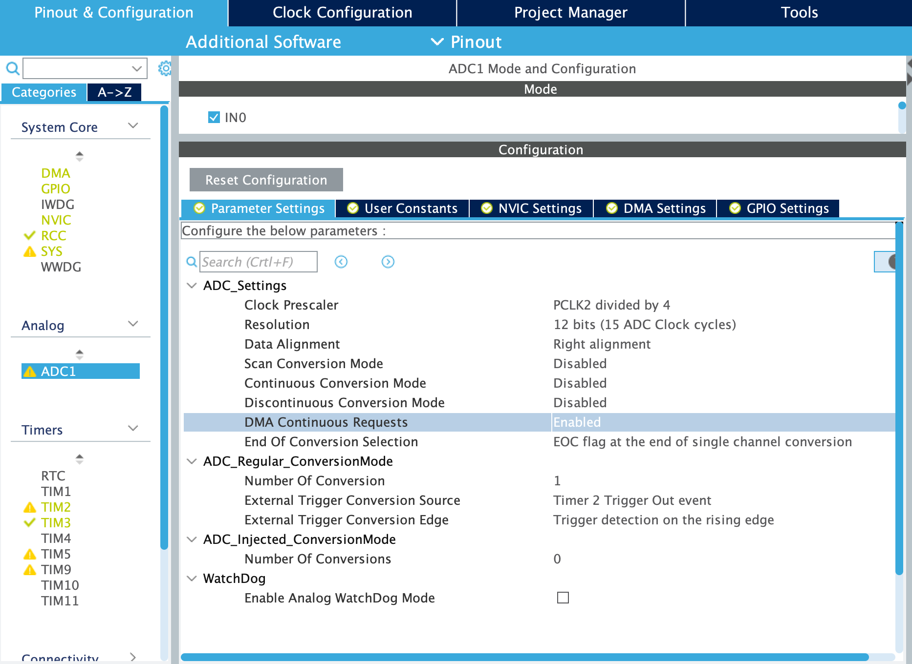
</a>
</p>

<p align="center">
<a href="../assets/imgs/dma-configuration.png">
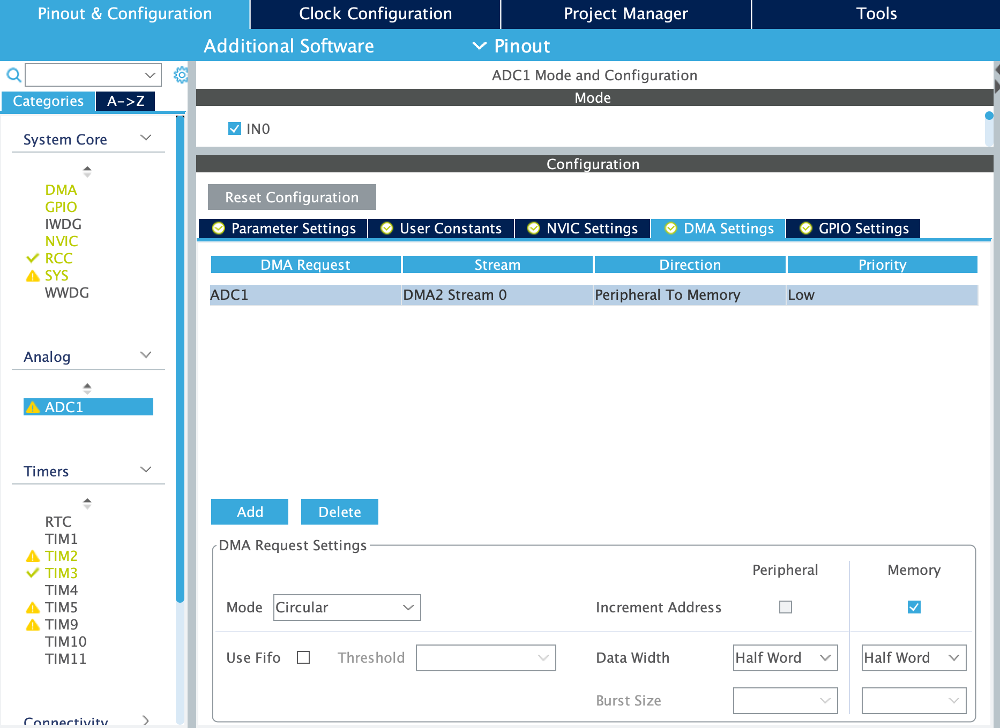
</a>
</p>

Now let’s **configure _timer_ 2**. We go to its configuration tab. We select `Internal Clock` in the `Clock Source` field. Then, we set a period of 2,000 clock cycles in the `Counter Period` field. Finally, we select `Update Event` in the `Trigger Event Selection` field. This would be the configuration:

<p align="center">
<a href="../assets/imgs/timer2-configuration.png">
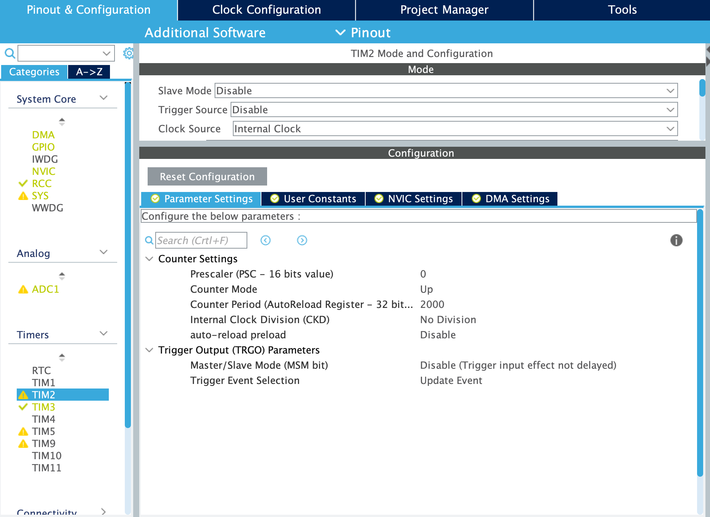
</a>
</p>

We have finished the configuration. Save the file and generate the code.

#### Periodic conversions with DMA

Let’s make our ADC _magically_ perform a conversion every 24 µs and store the result in the `potADC` variable 💪🏻 First, let’s go to our `main.c` file. **We will create our `potADC` variable, but this time of type `uint16_t`**. This time it is 16 bits, not 32, because in the DMA we configured it to move ADC values to memory with a _half-word_ (16 bits) size. Now, simply, **start the DMA** to be ready when the ADC conversions begin, and **start _timer_ 2** to execute a conversion periodically. For the first, we use the function `HAL_ADC_Start_DMA`. For the second, you already know it, `HAL_TIM_Base_Start`. The code would look like this:

```c
...
/* USER CODE BEGIN 2 */

    uint16_t potADC = 0; // no need to be global, it's local

  /* USER CODE END 2 */

  /* Infinite loop */
  /* USER CODE BEGIN WHILE */

    HAL_ADC_Start_DMA(&hadc1, (uint32_t*)&potADC, 1); // start DMA
    HAL_TIM_Base_Start(&htim2); // start timer --> conversions
	while (1)
	{
    /* USER CODE END WHILE */

    /* USER CODE BEGIN 3 */
	}
  /* USER CODE END 3 */
...
```

We compile and it shouldn't generate any errors. Now, let's add the missing code to send it via serial communication to the computer.

```c
...
  /* USER CODE BEGIN 2 */

    uint16_t potADC = 0; // no need to be global, it's local

  	char txBuffer[32] = { 0 }; // buffer for transmission
    uint8_t txBufferSize = 0; // size to send

  /* USER CODE END 2 */

  /* Infinite loop */
  /* USER CODE BEGIN WHILE */

    HAL_ADC_Start_DMA(&hadc1, (uint32_t*)&potADC, 1); // start DMA
    HAL_TIM_Base_Start(&htim2); // start timer --> conversions
	while (1)
	{

	  txBufferSize = sprintf(txBuffer, "0,4095,%lu\n", potADC); // encode number to text
	  HAL_UART_Transmit(&huart2, &txBuffer, txBufferSize, 1000); // send the data

    /* USER CODE END WHILE */

    /* USER CODE BEGIN 3 */
	}
  /* USER CODE END 3 */
...
```

We compile, debug, and start executing the program. We go to the `Serial Plotter` in Arduino IDE and see how the ADC value is sent correctly. All of this is done without having to manually convert or store the result in any variable. Everything is done automatically 😎

## Challenge

Drink two liters of water a day 💧 Now that's a challenge. For this practice, you don't have a challenge with the microcontroller. You can take a break 😉

<p align="center">

</p>

## Evaluation

### Deliverables

These are the items that should be available for the instructor for your evaluation.

- [ ] **Commits**

It is up to you when to make the _commits_. There is no minimum/maximum number, and the proper use of version control will be evaluated (branch creation, _commits_ at the right time, descriptive change messages, etc.).

- [ ] ~~**Challenge**~~

### Pull Request

Once all deliverables are finished, remember to push your changes and create a _Pull Request_ (PR) from your branch to the main. Don't forget to add me as a _Reviewer_.

### Rubric

The rubric we will use for evaluation can be found on the CampusVirtual. We recommend you take a look at it so you know exactly what will be evaluated and what is expected from you.

**The evaluation will start with the cleanliness and readability of the code** (aligned statements, nested statements with indentation, aligned keys, comments, etc.).

## Conclusions

Wow, all we've seen about the ADC. In this practice, we've learned **how to operate the ADC in a simple/rudimentary way using blocking functions** and activating conversion and reading the result by _software_. We've also seen a brief, brief, **very brief introduction to serial communication** to send the conversion results to the computer. We've done **conversion from more than one channel** and, finally, we've made the **conversion happen automatically on a periodic basis** and **the result automatically stored in memory**. We achieved this by activating the conversion with a _timer_ and moving data from the peripheral to memory with DMA.

In the next practice... **Serial communication!**
